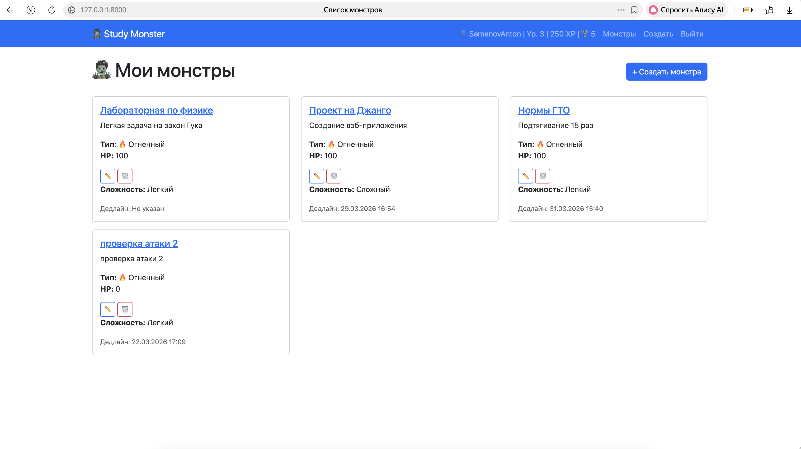
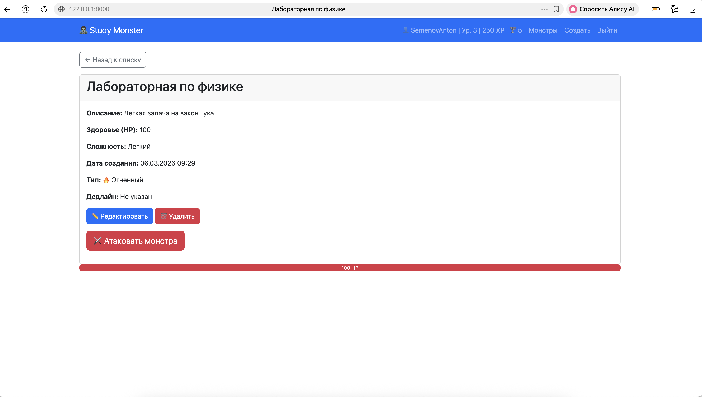
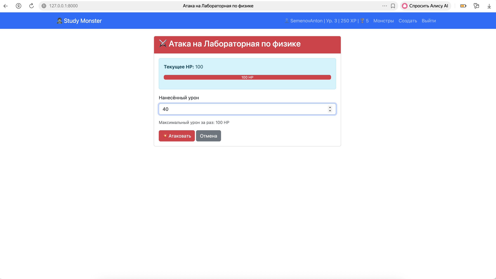
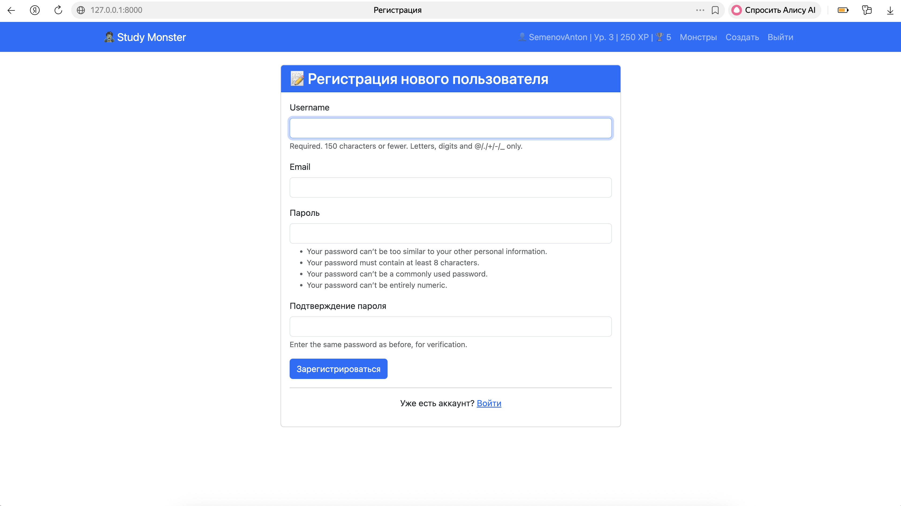

# 🧟‍♂️ Study Monster — Игровой таск-менеджер для учёбы

## 📋 О проекте

**Study Monster** — это веб-приложение для планирования учебных задач в игровой форме.  
Каждая задача представлена в виде **монстра**, которого нужно победить, выполняя учебные действия.

### 🎯 Решаемая проблема

Студенты часто забывают о сроках сдачи работ и теряют мотивацию.  
Study Monster превращает учёбу в игру:
- Каждая задача — монстр с очками здоровья (HP)
- Выполняя задания, игрок "атакует" монстра и уменьшает его HP
- За победу начисляется опыт (XP) и повышается уровень
- Ведётся история битв и статистика

---

## ✨ Функционал

- **Монстры** — создание, редактирование, удаление
- **Атака** — нанесение урона с умной валидацией
- **Опыт и уровни** — система прокачки
- **Статистика** — количество побед, опыт, уровень
- **Авторизация** — регистрация, вход, выход
- **Личный кабинет** — каждый видит только своих монстров
- **Валидация** — защита от некорректного ввода
- **Адаптивный дизайн** — Bootstrap 5

---

## 🛠 Технологии

- **Backend:** Django 6.0
- **Frontend:** Bootstrap 5, HTML, CSS
- **База данных:** SQLite
- **Качество кода:** Pylint 9.5/10

---

## 🚀 Установка и запуск

### 1. Клонировать репозиторий
\`\`\`bash
git clone https://github.com/ваш-username/study-monster.git
cd study-monster
\`\`\`

### 2. Создать виртуальное окружение
\`\`\`bash
python -m venv venv
source venv/bin/activate  # для Mac/Linux
# или
venv\Scripts\activate     # для Windows
\`\`\`

### 3. Установить зависимости
\`\`\`bash
pip install django
\`\`\`

### 4. Применить миграции
\`\`\`bash
python manage.py migrate
\`\`\`

### 5. Создать суперпользователя
\`\`\`bash
python manage.py createsuperuser
\`\`\`

### 6. Запустить сервер
\`\`\`bash
python manage.py runserver
\`\`\`

### 7. Открыть в браузере
\`\`\`
http://127.0.0.1:8000
\`\`\`

---

## 📸 Скриншоты

### Главная страница

### Детальная страница

### Создание монстра

### Атака на монстра

### Регистрация

---

## 🎮 Как играть

1. **Зарегистрируйся** или войди в систему
2. **Создай монстра** — задай имя, описание, HP, сложность, тип и дедлайн
3. **Атакуй монстра** — вводи урон (сколько минут/часов позанимался)
4. **Следи за прогрессом** — HP уменьшается, опыт растёт
5. **Побеждай монстров** — получай опыт и повышай уровень

---

## 📊 Оценка по критериям

| Критерий | Статус |
|----------|--------|
| UI/Frontend | ✅ Bootstrap 5, адаптив |
| CRUD + 2 формы | ✅ Полный CRUD + форма атаки |
| Валидация форм | ✅ Все поля проверяются |
| Бизнес-задача | ✅ Геймификация (опыт, уровни) |
| Качество кода (Pylint) | ✅ Оценка 9.5/10 |
| Git-репозиторий | ✅ README, .gitignore, коммиты |

---

## 👨‍💻 Автор

**Семенов Антон**  
GitHub: [@ggtx6v5fgn-ux](https://github.com/ggtx6v5fgn-ux)

---

## 📄 Лицензия

Учебный проект.